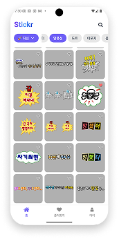
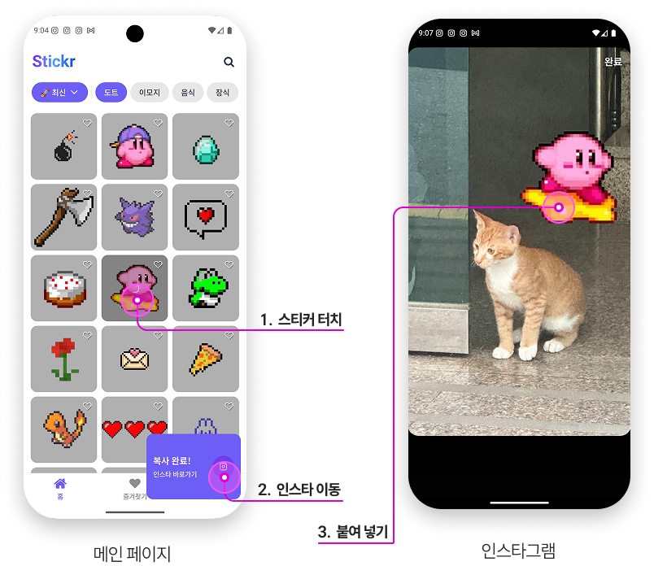
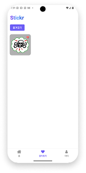
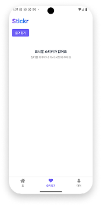
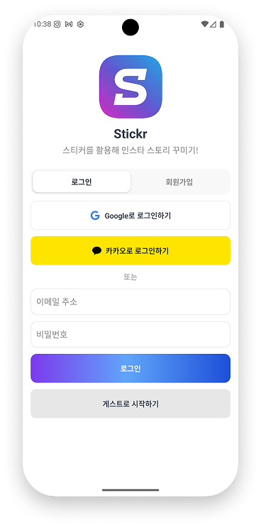
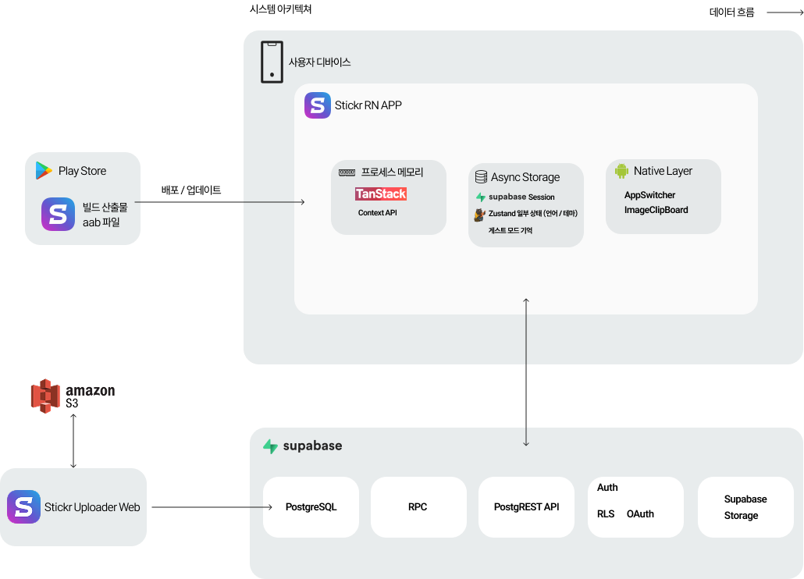

<div align="center">

<!-- logo -->


# Stickr

### 스티커를 클립보드에 담아 어디든 붙여넣으세요 🎨


</div>

<br/>

## 📋 목차
1. [프로젝트 소개](#-프로젝트-소개)
2. [시작 가이드](#-시작-가이드)
3. [기술 스택](#-기술-스택)
4. [화면 구성](#-화면-구성)
5. [주요 기능](#-주요-기능)
6. [아키텍쳐](#-아키텍쳐)
7. [기술적 이슈와 해결 과정](#-기술적-이슈와-해결-과정)

<br/>

## 🎯 프로젝트 소개

> **개인 프로젝트** - 1인 개발

**Stickr**는 다양한 스티커를 탐색하고, 클립보드에 복사하여 인스타그램, 카카오톡 등 다양한 앱에서 바로 사용할 수 있는 React Native 기반 모바일 애플리케이션입니다.

사용자는 카테고리별로 분류된 스티커를 빠르게 검색하고, 원하는 스티커를 탭 한 번으로 클립보드에 복사할 수 있습니다. 복사된 이미지는 인스타그램 스토리, DM 등 어디든 붙여넣기가 가능하며, 특히 인스타그램과의 원활한 연동을 위해 네이티브 모듈을 직접 구현하여 최적화된 사용자 경험을 제공합니다.

### 📅 개발 기간
- **2025-09-28 ~ 유지 보수 개선 진행중**

### 🔗 배포 주소
- **Google Play Store**:  https://play.google.com/store/apps/details?id=com.enommiski.stickrapp 
- **App Store**: (준비 중)

### 👥 개발자

<div align="center">


**김민서**

[](https://github.com/kingmingseo)

</div>

<br/>

## 🚀 시작 가이드

### Requirements
프로젝트를 실행하기 위해서는 다음 사항들이 필요합니다.

- [Node.js 20.x 이상](https://nodejs.org/)
- [npm](https://www.npmjs.com/) 또는 [yarn](https://yarnpkg.com/)
- [React Native 개발 환경](https://reactnative.dev/docs/environment-setup)
- Android Studio (Android 개발)
- Xcode (iOS 개발, macOS만 해당)

### Installation
```bash
# Repository 클론
$ git clone https://github.com/YOUR_USERNAME/Stickr.git
$ cd Stickr

# 패키지 설치
$ npm install

# iOS 의존성 설치 (macOS만 해당)
$ cd ios
$ bundle install
$ bundle exec pod install
$ cd ..
```

### Environment Variables
프로젝트 루트에 `.env` 파일을 생성하고 다음 환경 변수를 설정하세요:

```env
# Supabase
SUPABASE_URL=your_supabase_url
SUPABASE_ANON_KEY=your_supabase_anon_key

# AWS S3
AWS_ACCESS_KEY_ID=your_aws_access_key
AWS_SECRET_ACCESS_KEY=your_aws_secret_key
AWS_REGION=your_aws_region
AWS_BUCKET_NAME=your_bucket_name
```

### Run
```bash
# Metro 번들러 시작
$ npm start

# Android 실행
$ npm run android

# iOS 실행 (macOS만 해당)
$ npm run ios
```

<br/>

## 🛠 기술 스택

### Environment


### Config


### Development


### Backend & Database


### Test


<br/>

## 📱 화면 구성

| 메인 화면 | 핵심 기능 |
|:---:|:---:|
|  |  |
| 카테고리별 스티커 목록을 인기순/최신순으로 정렬하여 표시하는 화면 | 스티커를 탭하여 클립보드에 복사하고, 인스타그램 버튼으로 바로 이동하는 기능 |

| 검색 화면 | 즐겨찾기 화면 | 즐겨찾기 빈 화면 |
|:---:|:---:|:---:|
|  |  |  |
| 키워드로 스티커를 검색하는 화면 | 사용자가 즐겨찾기한 스티커 목록을 보여주는 화면 | 즐겨찾기가 비어있을 때 표시되는 화면 |

| 마이페이지 | 로그인 화면 |
|:---:|:---:|
|  |  |
| 사용자 프로필 정보를 확인하는 화면 | Google, Kakao 소셜 로그인을 제공하는 인증 화면 |

<br/>

## ✨ 주요 기능

### 📌 스티커 탐색 및 정렬
- 카테고리별 스티커 분류 (이모지, 동물, 음식, 자연 등)
- 인기순/최신순 정렬 기능
- 무한 스크롤을 통한 스티커 목록 로딩

### 🔍 스마트 검색
- 키워드 기반 실시간 검색 (제목, 태그)
- 검색 시 이전 캐시 제거로 중복 방지
- 무한 스크롤을 통한 검색 결과 페이지네이션
- React Query를 활용한 검색 결과 캐싱 및 최적화

### 📋 원클릭 이미지 복사
- **Android**: `FileProvider`를 활용한 네이티브 모듈로 클립보드에 이미지 URI 등록
- **iOS**: `@react-native-clipboard/clipboard`를 활용한 이미지 복사
- 다운로드한 이미지를 캐시 디렉터리에 임시 저장 후 자동 정리
- 복사 성공 시 토스트 메시지와 함께 인스타그램 바로가기 버튼 제공

### 📱 인스타그램 연동
- Android: 네이티브 모듈로 기존 인스타그램 태스크를 포그라운드로 전환
- iOS: 딥링크를 통한 인스타그램 앱 실행
- 앱 미설치 시 웹 URL로 폴백

### ⭐ 즐겨찾기
- 자주 사용하는 스티커를 즐겨찾기에 추가/제거
- 즐겨찾기 목록에서 빠르게 접근

### 👤 사용자 인증 및 프로필
- 소셜 로그인 (Supabase Auth)
  - Google (Android)
  - Kakao (Android/iOS)
  - Apple (iOS, 준비 중)
- 이메일 회원가입 및 로그인
- 프로필 이미지 업로드 및 수정 (AWS S3)
- 닉네임 변경 기능
- 게스트 모드 지원

### 🌐 다국어 지원
- 한국어/영어 지원
- 시스템 언어에 따른 자동 전환

### 🎨 테마 지원
- 라이트/다크 모드 지원 (구현 중)

<br/>

## 🏗 아키텍쳐



### 디렉토리 구조
```
src/
├── api/                    # API 통신 로직
│   ├── profile.ts          # 프로필 관련 API
│   ├── queryClient.ts      # React Query 설정
│   ├── sticker.ts          # 스티커 관련 API
│   └── supabaseClient.ts   # Supabase 클라이언트
├── assets/                 # 이미지, 아이콘 등 정적 리소스
│   ├── guest.png
│   ├── instagram.svg
│   ├── Kakao.svg
│   ├── Stickr.png
│   └── onboarding/         # 온보딩 이미지
├── components/             # 재사용 가능한 UI 컴포넌트
│   ├── AuthForm.tsx
│   ├── ChipButton.tsx
│   ├── ChipButtonGroup.tsx
│   ├── DropdownMenu.tsx
│   ├── InputField.tsx
│   ├── StickerCard.tsx
│   └── StickerCardContainer.tsx
│   └── ... (21개 컴포넌트)
├── config/                 # 설정 파일
│   └── aws.ts              # AWS S3 설정
├── constants/              # 상수 정의
│   ├── categories.ts       # 카테고리 정보
│   ├── colors.ts           # 색상 팔레트
│   ├── numbers.ts          # 숫자 상수
│   └── translations.ts     # 다국어 텍스트
├── contexts/               # React Context
│   └── FilterContext.tsx   # 필터 상태 관리
├── hooks/                  # 커스텀 훅
│   ├── keyboard/
│   │   └── useKeyboard.ts  # 키보드 스마트 스크롤
│   ├── query/              # React Query 훅
│   │   ├── useInfiniteStickers.ts
│   │   ├── useMutateProfile.ts
│   │   └── ... (6개 훅)
│   ├── useAuth.ts
│   ├── useImagePicker.ts
│   ├── useModal.ts
│   ├── useSupabaseSession.ts
│   └── useTranslation.ts
├── navigations/            # React Navigation 설정
│   ├── AuthNavigation.tsx
│   ├── BottomTabNavigation.tsx
│   ├── MypageNavigation.tsx
│   └── RootNavigation.tsx
├── screens/                # 화면 컴포넌트
│   ├── auth/
│   │   └── AuthHomeScreen.tsx
│   ├── favorites/
│   │   └── FavoritesScreen.tsx
│   ├── home/
│   │   ├── MainScreen.tsx
│   │   └── StickerDetailScreen.tsx
│   ├── my/
│   │   ├── IndividualEditScreen.tsx
│   │   ├── MyPageScreen.tsx
│   │   └── ProfileEditScreen.tsx
│   ├── onboarding/
│   │   └── GboardOnboardingScreen.tsx
│   └── search/
│       └── SearchScreen.tsx
├── store/                  # 전역 상태 관리 (Zustand)
│   ├── authStore.ts
│   └── themeStore.ts
├── types/                  # TypeScript 타입 정의
│   ├── common.ts
│   ├── domain.ts
│   ├── navigation.ts
│   ├── sticker.ts
│   └── user.ts
└── utils/                  # 유틸리티 함수
    └── grid.ts

android/                    # Android 네이티브 모듈
└── app/src/main/java/com/stickr/
    ├── clipboard/          # 이미지 클립보드 복사 모듈
    │   └── ImageClipboardModule.kt
    └── appswitcher/        # 앱 전환 모듈
        └── AppSwitcherModule.kt

docs/                       # 기술 문서
├── 키보드 겹침 문제.md
├── 검색 창 키 겹침 문제.md
├── 즐겨찾기 상태 불일치 문제.md
├── 앱전환 안됨 문제.md
└── SVG직접사용 불가능 문제.md
```

<br/>

## 🤔 기술적 이슈와 해결 과정

### 1. 키보드와 입력 필드 겹침 문제
- **문제**: 로그인/회원가입 폼에서 키보드가 올라올 때 입력 필드가 키보드에 가려지는 UX 이슈
- **해결**:
  - `measureInWindow`로 측정한 좌표가 상대적 위치라는 점을 고려한 누적 이동량 계산
  - `useState`의 비동기 특성으로 인한 계산 오류를 `useRef`로 해결
  - 키보드 이벤트 리스닝과 애니메이션을 통합한 커스텀 훅 `useKeyboard` 구현
  - 필요한 만큼만 화면을 이동시키는 스마트 스크롤 로직 적용
- **상세**: [키보드 겹침 문제.md](./docs/키보드%20겹침%20문제.md)

### 2. 인스타그램 앱 전환 최적화
- **문제**: 스티커 복사 후 인스타그램 앱으로 전환할 때 새 태스크가 생성되어 사용자가 작업하던 스토리가 초기화되는 문제
- **해결**:
  - Android: 네이티브 모듈로 `FLAG_ACTIVITY_RESET_TASK_IF_NEEDED` 플래그를 사용한 기존 태스크 포그라운드 전환
  - Android 11+: `queries` 선언으로 패키지 가시성 확보
  - 앱 미설치 시 웹 URL로 폴백하는 다중 계층 에러 처리
- **상세**: [앱전환 안됨 문제.md](./docs/앱전환%20안됨%20문제.md)

### 3. 즐겨찾기 상태 불일치 문제
- **문제**: React Navigation의 LazyLoading과 로컬 state로 인해 홈 탭과 즐겨찾기 탭 간 즐겨찾기 상태가 동기화되지 않는 이슈
- **해결**:
  - 컴포넌트의 모든 로컬 state 제거하고 TanStack Query 캐시를 Single Source of Truth로 사용
  - Optimistic Update로 즉각적인 UI 피드백 제공
  - `onMutate`, `onError`를 활용한 자동 롤백으로 안정성 확보
  - 복잡한 동기화 로직 대신 동기화가 필요 없는 구조로 근본적 해결
- **상세**: [즐겨찾기 상태 불일치 문제.md](./docs/즐겨찾기%20상태%20불일치%20문제.md)

### 4. 검색 결과 중복 키 이슈
- **문제**: Supabase 쿼리에서 `ORDER BY` 누락으로 인해 Cursor 기반 페이지네이션 시 중복 데이터가 발생하는 문제
- **해결**: 
  - `like_count DESC, auto_increment_id DESC` 순서로 일관된 정렬 보장
  - Cursor 조건과 정렬 순서를 일치시켜 페이지 경계 명확화
  - PostgreSQL의 정렬 없는 쿼리가 예측 불가능한 순서를 반환한다는 점 인지
- **상세**: [검색 창 키 겹침 문제.md](./docs/검색%20창%20키%20겹침%20문제.md)

### 5. SVG 이미지 지원
- **문제**: React Native에서 SVG 파일을 React 컴포넌트로 import하여 사용할 수 없는 문제
- **해결**: 
  - `react-native-svg-transformer`로 SVG를 컴포넌트로 변환
  - Metro 설정에서 SVG를 소스 파일로 인식하도록 설정
  - TypeScript 타입 선언으로 타입 안정성 확보
- **상세**: [SVG직접사용 불가능 문제.md](./docs/SVG직접사용%20불가능%20문제.md)

<br/>

---

<div align="center">

### 🛠 계속해서 유지 보수 중인 프로젝트입니다

더 나은 사용자 경험을 위해 지속적으로 개선하고 있습니다.

</div>
