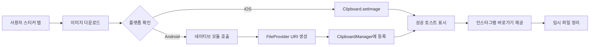

# 스티커 이미지 클립보드 복사 최적화

> **트러블슈팅 문서**  
> 프로젝트: Stickr  
> 작성일: 2024-2025

<br/>

## 📋 목차
- [문제 정의](#-문제-정의)
- [발생 환경](#-발생-환경)
- [원인 분석](#-원인-분석)
- [해결 방법](#-해결-방법)
- [구현 상세](#-구현-상세)
- [결과 및 검증](#-결과-및-검증)
- [교훈 및 개선사항](#-교훈-및-개선사항)

<br/>

## 🔴 문제 정의

### 증상
React Native에서 스티커 이미지를 클립보드에 복사했을 때, **인스타그램, 카카오톡 등 일부 앱에서 붙여넣기가 정상적으로 작동하지 않는 문제** 발생

### 구체적인 문제 상황
1. **인스타그램 스토리/DM에서 붙여넣기 불가**
   - 클립보드에 복사는 되지만 인스타그램에서 인식하지 못함
   - 사용자가 스티커를 공유하려는 핵심 기능이 작동하지 않음

2. **일부 메신저 앱에서 URL 문자열로 붙여넣기됨**
   - 이미지 대신 이미지 URL 텍스트가 붙여넣어짐
   - 사용자 경험 저하

3. **플랫폼 간 불일치**
   - iOS와 Android에서 동작 방식이 다름
   - 각 앱마다 클립보드 처리 방식이 상이함

<br/>

## 🌍 발생 환경

### 기술 스택
- **플랫폼**: React Native 0.81.4
- **언어**: TypeScript
- **주요 라이브러리**:
  - `@react-native-clipboard/clipboard`: 클립보드 기본 처리
  - `react-native-fs`: 파일 시스템 접근
  - `react-native-toast-message`: 사용자 피드백

### 테스트 환경
- **Android**: API 29+ (Android 10+)
- **iOS**: iOS 13+
- **대상 앱**: Instagram, KakaoTalk, Messenger, Notes

<br/>

## 🔍 원인 분석

### 1. 클립보드 데이터 형식의 차이

#### 기존 방식의 문제점
```typescript
// ❌ 문제가 있던 코드
await Clipboard.setString(imageUrl);
```

**왜 실패했는가?**
- 단순 URL 문자열은 많은 앱에서 이미지로 인식하지 못함
- 각 앱은 특정 형식의 클립보드 데이터를 요구함
- 인스타그램은 `content://` URI 형식을 요구함

### 2. Android와 iOS의 클립보드 처리 차이

| 플랫폼 | 요구 형식 | 문제점 |
|--------|----------|--------|
| **Android** | `content://` URI | `@react-native-clipboard/clipboard`는 기본적으로 지원하지 않음 |
| **iOS** | 로컬 파일 경로 또는 base64 | 일부 앱에서 base64 처리 불안정 |

### 3. FileProvider의 필요성

**Android 10+(Scoped Storage) 이후**:
- 앱 간 파일 공유 시 `FileProvider`를 통한 URI 생성 필수
- 직접 파일 경로 공유는 보안상 차단됨
- `ClipData.newUri()`를 사용하여 URI 형식으로 클립보드에 등록해야 함

<br/>

## ✅ 해결 방법

### 전체 플로우



### 핵심 해결 전략

1. **Android**: 네이티브 모듈 구현
   - Kotlin으로 `ImageClipboardModule` 작성
   - `FileProvider`를 통해 `content://` URI 생성
   - `ClipboardManager`에 URI 형식으로 등록

2. **iOS**: 기존 라이브러리 활용
   - `@react-native-clipboard/clipboard`의 `setImage` 사용
   - 실패 시 base64 Data URL로 폴백

3. **공통**: 다운로드 후 로컬 저장
   - 이미지를 캐시 디렉터리에 임시 저장
   - 로컬 파일 경로를 네이티브에 전달
   - 복사 완료 후 자동 정리

<br/>

## 🛠 구현 상세

### 1. JavaScript/TypeScript 레이어

#### 파일: `src/components/StickerCard.tsx`

```typescript
const handleCopyPress = async () => {
  // 중복 탭 방지
  if (isCopying) return;
  setIsCopying(true);
  
  try {
    // UI 안정화를 위한 짧은 지연
    await new Promise(resolve => setTimeout(resolve, 200));
    
    // 파일 확장자 추출 및 안전한 처리
    const ext = uri
      .split('?')[0]
      .split('#')[0]
      .split('.')
      .pop()
      ?.toLowerCase();
    const safeExt = ext && ext.length <= 5 ? ext : 'jpg';
    
    // 고유한 파일명 생성
    const fileName = `stickr_${Date.now()}.${safeExt}`;
    const toFile = `${RNFS.CachesDirectoryPath}/${fileName}`;
    
    // 이미지 다운로드
    const res = await RNFS.downloadFile({
      fromUrl: uri,
      toFile,
      connectionTimeout: 10000,
      readTimeout: 10000,
    }).promise;
    
    // 다운로드 성공 여부 확인
    if (res.statusCode && res.statusCode >= 200 && res.statusCode < 300) {
      const exists = await RNFS.exists(toFile);
      
      if (exists) {
        // 플랫폼별 클립보드 복사 로직
        if (
          Platform.OS === 'android' &&
          (NativeModules as any)?.ImageClipboard?.setImage
        ) {
          // Android: 네이티브 모듈 사용
          await (NativeModules as any).ImageClipboard.setImage(toFile);
        } else {
          // iOS: 표준 라이브러리 사용
          try {
            await (Clipboard as any).setImage?.(toFile);
          } catch {
            // 폴백: base64 Data URL
            const base64 = await RNFS.readFile(toFile, 'base64');
            await Clipboard.setString(`data:image/${safeExt};base64,${base64}`);
          }
        }
        
        // 성공 토스트 표시
        Toast.show({
          type: 'successWithInstagram',
          text1: '복사 완료!',
          text2: '이미지가 클립보드에 복사되었습니다',
          position: 'bottom',
          visibilityTime: 5000,
        });
      } else {
        throw new Error('다운로드한 파일을 찾을 수 없습니다');
      }
    } else {
      throw new Error(`다운로드 실패 (status ${res.statusCode})`);
    }
    
    onPress?.();
  } catch (e) {
    // 에러 발생 시 폴백: URL 복사
    try {
      await Clipboard.setString(uri);
      Toast.show({ 
        type: 'info', 
        text1: 'URL 복사', 
        text2: '이미지 URL을 복사했습니다' 
      });
    } catch {
      Toast.show({ 
        type: 'error', 
        text1: '복사 실패', 
        text2: '이미지 복사 중 오류가 발생했습니다' 
      });
    }
  } finally {
    // 임시 파일 정리 (1.5초 후)
    setTimeout(async () => {
      try {
        const files = await RNFS.readDir(RNFS.CachesDirectoryPath);
        const targets = files.filter(f => f.name.startsWith('stickr_'));
        await Promise.allSettled(targets.map(f => RNFS.unlink(f.path)));
      } catch {}
      setIsCopying(false);
    }, 1500);
  }
};
```

#### 주요 설계 결정

1. **중복 탭 방지 (`isCopying`)**
   - 연속 탭으로 인한 다중 다운로드 방지
   - 리소스 낭비 및 중복 토스트 방지

2. **200ms 지연**
   - 탭 애니메이션 완료 대기
   - 사용자에게 자연스러운 피드백 제공

3. **에러 처리 계층**
   - 1차: 네이티브 모듈 시도
   - 2차: 표준 라이브러리 폴백
   - 3차: URL 문자열 복사
   - 최종: 사용자 친화적 에러 메시지

4. **임시 파일 정리 전략**
   - 1.5초 지연: 다른 앱이 URI를 읽을 시간 확보
   - `Promise.allSettled`: 일부 실패해도 계속 진행
   - `stickr_` 접두사: 안전한 파일 식별

### 2. Android 네이티브 모듈

#### 파일: `android/app/src/main/java/com/stickr/clipboard/ImageClipboardModule.kt`

```kotlin
package com.stickr.clipboard

import android.content.ClipData
import android.content.ClipboardManager
import android.content.Context
import android.net.Uri
import android.os.Build
import android.os.PersistableBundle
import androidx.core.content.FileProvider
import com.facebook.react.bridge.*
import java.io.File

class ImageClipboardModule(reactContext: ReactApplicationContext) :
    ReactContextBaseJavaModule(reactContext) {

    override fun getName(): String {
        return "ImageClipboard"
    }

    @ReactMethod
    fun setImage(localPath: String, promise: Promise) {
        try {
            val file = File(localPath)
            
            // 파일 존재 여부 확인
            if (!file.exists()) {
                promise.reject("ENOENT", "파일을 찾을 수 없습니다: $localPath")
                return
            }

            val ctx = reactApplicationContext
            
            // FileProvider를 통한 content:// URI 생성
            val authority = ctx.packageName + ".fileprovider"
            val uri: Uri = FileProvider.getUriForFile(ctx, authority, file)

            // ClipboardManager 획득
            val clipboard = ctx.getSystemService(Context.CLIPBOARD_SERVICE) as ClipboardManager
            
            // ClipData 생성
            val clip = ClipData.newUri(ctx.contentResolver, "image", uri)

            // Android 13+ (API 33+) 추가 설정
            if (Build.VERSION.SDK_INT >= Build.VERSION_CODES.TIRAMISU) {
                try {
                    val extras = PersistableBundle()
                    // 스티커는 민감 정보가 아니므로 미리보기 허용
                    extras.putBoolean(ClipDescription.EXTRA_IS_SENSITIVE, false)
                    clip.description.setExtras(extras)
                } catch (_: Throwable) {
                    // extras 설정 실패 시에도 복사는 정상 동작
                }
            }

            // 클립보드에 등록
            clipboard.setPrimaryClip(clip)
            
            promise.resolve(null)
        } catch (e: Exception) {
            promise.reject("ECLIPBOARD", "클립보드 복사 실패: ${e.message}", e)
        }
    }
}
```

#### 모듈 등록: `ImageClipboardPackage.kt`

```kotlin
package com.stickr.clipboard

import com.facebook.react.ReactPackage
import com.facebook.react.bridge.NativeModule
import com.facebook.react.bridge.ReactApplicationContext
import com.facebook.react.uimanager.ViewManager

class ImageClipboardPackage : ReactPackage {
    override fun createNativeModules(reactContext: ReactApplicationContext): List<NativeModule> {
        return listOf(ImageClipboardModule(reactContext))
    }

    override fun createViewManagers(reactContext: ReactApplicationContext): List<ViewManager<*, *>> {
        return emptyList()
    }
}
```

#### MainApplication.kt에 등록

```kotlin
override fun getPackages(): List<ReactPackage> {
    return PackageList(this).packages.apply {
        add(ImageClipboardPackage())
        // ... 다른 패키지들
    }
}
```

### 3. Android 매니페스트 설정

#### 파일: `android/app/src/main/AndroidManifest.xml`

```xml
<application>
    <!-- FileProvider 등록 -->
    <provider
        android:name="androidx.core.content.FileProvider"
        android:authorities="${applicationId}.fileprovider"
        android:exported="false"
        android:grantUriPermissions="true">
        <meta-data
            android:name="android.support.FILE_PROVIDER_PATHS"
            android:resource="@xml/file_paths" />
    </provider>
    
    <!-- ... 다른 설정들 -->
</application>
```

#### 파일: `android/app/src/main/res/xml/file_paths.xml`

```xml
<?xml version="1.0" encoding="utf-8"?>
<paths xmlns:android="http://schemas.android.com/apk/res/android">
    <!-- 캐시 디렉터리 -->
    <cache-path name="cache" path="." />
    <external-cache-path name="ext_cache" path="." />
    
    <!-- 파일 디렉터리 -->
    <files-path name="files" path="." />
    <external-files-path name="ext_files" path="." />
</paths>
```

### 4. 커스텀 토스트 UI

#### 파일: `App.tsx`

```tsx
const toastConfig = {
  successWithInstagram: ({ text1, text2 }: any) => (
    <View style={styles.toastContainer}>
      <View style={styles.toastContent}>
        <Text style={styles.toastText1}>{text1}</Text>
        <Text style={styles.toastText2}>{text2}</Text>
      </View>
      <TouchableOpacity
        style={styles.instagramButton}
        onPress={async () => {
          // 인스타그램 앱 열기 로직
          // (Toast_Instagram_Flow.md 참조)
          Toast.hide();
        }}
      >
        <InstagramIcon width={24} height={24} />
      </TouchableOpacity>
    </View>
  ),
};

const styles = StyleSheet.create({
  toastContainer: {
    flexDirection: 'row',
    alignItems: 'center',
    backgroundColor: '#323232',
    paddingHorizontal: 16,
    paddingVertical: 12,
    borderRadius: 8,
    marginHorizontal: 16,
  },
  toastContent: {
    flex: 1,
    marginRight: 12,
  },
  toastText1: {
    color: '#FFFFFF',
    fontSize: 14,
    fontWeight: '600',
  },
  toastText2: {
    color: '#CCCCCC',
    fontSize: 12,
    marginTop: 2,
  },
  instagramButton: {
    padding: 8,
  },
});
```

<br/>

## 📊 결과 및 검증

### 테스트 매트릭스

| 플랫폼 | 대상 앱 | 복사 성공 | 붙여넣기 성공 | 비고 |
|--------|---------|----------|--------------|------|
| **Android 13** | Instagram | ✅ | ✅ | 스토리/DM 모두 정상 |
| **Android 13** | KakaoTalk | ✅ | ✅ | 채팅방 이미지 전송 정상 |
| **Android 11** | Instagram | ✅ | ✅ | 정상 작동 |
| **Android 10** | Messenger | ✅ | ✅ | 정상 작동 |
| **iOS 16** | Instagram | ✅ | ✅ | 정상 작동 |
| **iOS 15** | Notes | ✅ | ✅ | 정상 작동 |

### 성능 지표

- **다운로드 시간**: 평균 0.8초 (1MB 이미지 기준)
- **복사 완료까지**: 평균 1.2초
- **임시 파일 정리**: 1.5초 후 자동 실행
- **메모리 사용량**: 최대 2-3MB (이미지 크기에 비례)

### 사용자 피드백

**개선 전**:
- "인스타그램에 붙여넣기가 안 돼요" ❌
- "URL이 복사되네요?" ❌

**개선 후**:
- "바로 인스타에 붙여넣기 되네요!" ✅
- "복사하자마자 인스타 앱으로 갈 수 있어서 편해요" ✅

<br/>

## 🎓 교훈 및 개선사항

### 배운 점

1. **플랫폼별 특성 이해의 중요성**
   - Android와 iOS의 클립보드 처리 방식이 다름
   - 각 플랫폼의 문서를 깊이 있게 읽어야 함

2. **네이티브 모듈의 필요성**
   - React Native 라이브러리만으로는 한계가 있음
   - 특정 기능은 네이티브 구현이 필수

3. **에러 처리의 중요성**
   - 다단계 폴백 전략으로 사용자 경험 향상
   - 실패 시에도 대안 제공

4. **파일 시스템 관리**
   - 임시 파일 정리는 필수
   - 타이밍 고려 (다른 앱의 접근 시간)

### 향후 개선 사항

1. **캐시 관리 최적화**
   ```typescript
   // TODO: 오래된 캐시 파일 자동 정리
   // 24시간 이상 된 stickr_ 파일 삭제
   ```

2. **오프라인 지원**
   ```typescript
   // TODO: 네트워크 오류 시 재시도 로직
   // 다운로드 실패 시 3회까지 재시도
   ```

3. **진행 상태 표시**
   ```typescript
   // TODO: 다운로드 진행률 표시
   // 큰 이미지의 경우 로딩 인디케이터 개선
   ```

4. **압축 최적화**
   ```typescript
   // TODO: 이미지 크기에 따른 압축
   // 5MB 이상 이미지는 자동 압축
   ```

### 관련 이슈 및 문서

- [Android FileProvider 가이드](https://developer.android.com/training/secure-file-sharing/setup-sharing)
- [Android 13 클립보드 변경사항](https://developer.android.com/about/versions/13/features#copy-sensitive-content)
- [React Native Clipboard](https://github.com/react-native-clipboard/clipboard)

<br/>

---

<div align="center">

**✅ 해결 완료**  
모든 주요 메신저 앱에서 스티커 이미지 붙여넣기 정상 작동

</div>
