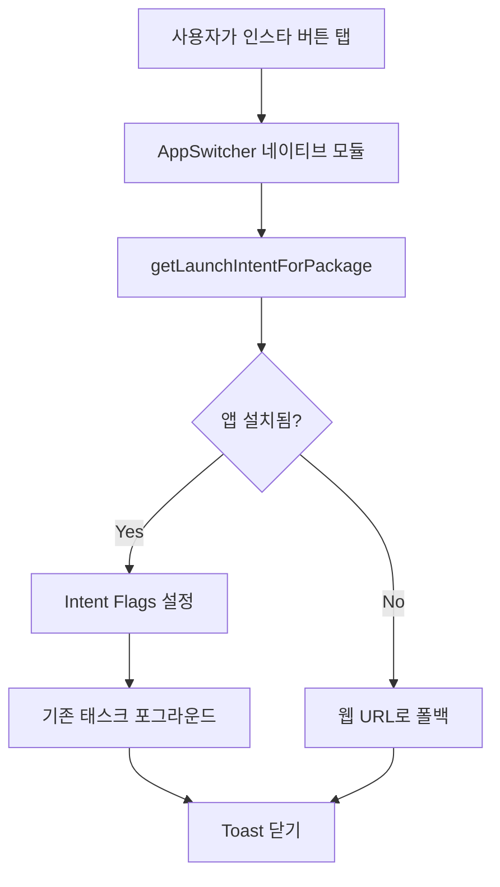

# 인스타그램 앱 전환 최적화

> **트러블슈팅 문서**  
> 프로젝트: Stickr  
> 작성일: 20251031

<br/>

## 📋 목차
- [문제 정의](#-문제-정의)
- [발생 환경](#-발생-환경)
- [원인 분석](#-원인-분석)
- [해결 방법](#-해결-방법)
- [구현 상세](#-구현-상세)
- [결과 및 검증](#-결과-및-검증)
- [교훈 및 개선사항](#-교훈-및-개선사항)

<br/>

## 🔴 문제 정의

### 증상
스티커 복사 완료 토스트에서 **인스타그램 버튼을 탭하면 새로운 인스타그램 태스크가 생성**되어 앱 전환 경험이 부자연스러움

### 구체적인 문제 상황

1. **새 태스크 생성 문제**
   - 기존에 열려있던 인스타그램 화면이 있어도 새로 시작됨
   - 사용자가 보던 화면이 초기화됨

2. **사용자 플로우 단절**
   ```
   예상된 플로우:
   Stickr에서 스티커복사 → 인스타그램(기존 화면) → 스토리 작성 -> Stickr에서 2번째 스티커 복사 -> 스토리 마저 작성
   
   실제 플로우:
   Stickr에서 스티커 복사 → 인스타그램(새 인스턴스) → 스토리 작성 → Stickr에서 2번째 스티커 복사 -> 인스타 태스크 초기화(스토리 유지 안됨)
   ```

### 목표
**Android에서 기존 인스타그램 태스크를 포그라운드로 가져오면서 꾸미던 스토리가 유지되게 하고, 없으면 새로 시작**하는 스마트한 앱 전환 구현

<br/>

## 🌍 발생 환경

### 기술 스택
- **플랫폼**: React Native 0.81.4
- **언어**: TypeScript, Kotlin
- **주요 라이브러리**:
  - `react-native-toast-message`: 토스트 UI
  - React Native `Linking` API: 딥링크 처리

### 테스트 환경
- **Android**: API 29+ (Android 10+)
- **대상 앱**: Instagram

<br/>

## 🔍 원인 분석

### 1. 기본 Linking.openURL의 동작

```typescript
// ❌ 문제가 있던 코드
await Linking.openURL('instagram://app');
```

**문제점**:
- Android: 항상 새로운 태스크(`FLAG_ACTIVITY_NEW_TASK`)로 시작
- 기존 인스타그램 태스크가 있어도 새로 생성
- 사용자가 보던 화면 초기화

### 2. Android Intent Flag의 이해

#### `FLAG_ACTIVITY_NEW_TASK`
```kotlin
// 기본 동작
intent.addFlags(Intent.FLAG_ACTIVITY_NEW_TASK)
// → 항상 새 태스크 생성
```

#### `FLAG_ACTIVITY_RESET_TASK_IF_NEEDED`
```kotlin
// 스마트 동작
intent.addFlags(Intent.FLAG_ACTIVITY_NEW_TASK)
intent.addFlags(Intent.FLAG_ACTIVITY_RESET_TASK_IF_NEEDED)
// → 기존 태스크가 있으면 포그라운드로, 없으면 새로 생성
```

### 3. Android 11+ 패키지 가시성 문제

```kotlin
// ❌ Android 11+에서 실패
packageManager.getLaunchIntentForPackage("com.instagram.android")
// → null 반환 (패키지를 찾을 수 없음)
```

**원인**:
- Android 11부터 앱 간 패키지 조회 제한
- `AndroidManifest.xml`에 명시적으로 `queries` 선언 필요

<br/>

## ✅ 해결 방법

### 전략

**Android 네이티브 모듈 구현**
1. `getLaunchIntentForPackage()`로 런치 인텐트 획득
2. `FLAG_ACTIVITY_RESET_TASK_IF_NEEDED` 플래그 추가
3. 기존 태스크를 포그라운드로 가져오기
4. 앱 미설치 시 웹 URL로 폴백

### 플로우 다이어그램



<br/>

## 🛠 구현 상세

### 1. JavaScript/TypeScript 레이어

#### 파일: `App.tsx`

```tsx
import { NativeModules, Linking, Platform } from 'react-native';
import Toast from 'react-native-toast-message';

const toastConfig = {
  successWithInstagram: ({ text1, text2 }: any) => (
    <View style={styles.toastContainer}>
      <View style={styles.toastContent}>
        <Text style={styles.toastText1}>{text1}</Text>
        <Text style={styles.toastText2}>{text2}</Text>
      </View>
      
      <TouchableOpacity
        style={styles.instagramButton}
        onPress={handleInstagramPress}
      >
        <InstagramIcon width={24} height={24} />
      </TouchableOpacity>
    </View>
  ),
};

/**
 * 인스타그램 앱 열기 핸들러
 * 
 * 전략:
 * 1. Android 네이티브 모듈로 기존 태스크 포그라운드
 * 2. 실패 시 웹 URL로 폴백
 */
const handleInstagramPress = async () => {
  try {
    // Android 네이티브 모듈로 인스타그램 실행
    await (NativeModules as any).AppSwitcher.bringToForeground(
      'com.instagram.android'
    );
    Toast.hide();
  } catch (error) {
    console.error('인스타그램 열기 실패:', error);
    
    // 폴백: 웹 브라우저로 인스타그램 열기
    try {
      await Linking.openURL('https://www.instagram.com/');
    } catch (webError) {
      console.error('웹 URL 열기 실패:', webError);
    }
    Toast.hide();
  }
};

const styles = StyleSheet.create({
  toastContainer: {
    flexDirection: 'row',
    alignItems: 'center',
    backgroundColor: '#323232',
    paddingHorizontal: 16,
    paddingVertical: 12,
    borderRadius: 8,
    marginHorizontal: 16,
    // Android 클립보드 오버레이와 겹침 방지
    marginBottom: Platform.OS === 'android' ? 60 : 0,
  },
  toastContent: {
    flex: 1,
    marginRight: 12,
  },
  toastText1: {
    color: '#FFFFFF',
    fontSize: 14,
    fontWeight: '600',
  },
  toastText2: {
    color: '#CCCCCC',
    fontSize: 12,
    marginTop: 2,
  },
  instagramButton: {
    padding: 8,
    backgroundColor: 'rgba(255, 255, 255, 0.1)',
    borderRadius: 6,
  },
});
```

### 2. Android 네이티브 모듈

#### 파일: `android/app/src/main/java/com/stickr/appswitcher/AppSwitcherModule.kt`

```kotlin
package com.stickr.appswitcher

import android.content.Intent
import android.content.pm.PackageManager
import com.facebook.react.bridge.*

/**
 * 다른 앱을 포그라운드로 가져오는 네이티브 모듈
 * 
 * 주요 기능:
 * - 기존 태스크가 있으면 포그라운드로 가져오기
 * - 없으면 새로 시작
 * - 앱이 설치되지 않았으면 에러 반환
 */
class AppSwitcherModule(reactContext: ReactApplicationContext) :
    ReactContextBaseJavaModule(reactContext) {

    override fun getName(): String {
        return "AppSwitcher"
    }

    /**
     * 지정된 패키지의 앱을 포그라운드로 가져오기
     * 
     * @param packageName 대상 앱 패키지명 (예: "com.instagram.android")
     * @param promise React Native Promise
     */
    @ReactMethod
    fun bringToForeground(packageName: String, promise: Promise) {
        try {
            val ctx = reactApplicationContext
            val packageManager = ctx.packageManager

            // 런치 인텐트 획득
            val intent = packageManager.getLaunchIntentForPackage(packageName)
            
            if (intent == null) {
                promise.reject(
                    "ENOAPP",
                    "앱을 찾을 수 없습니다: $packageName"
                )
                return
            }

            // Intent Flags 설정
            intent.addCategory(Intent.CATEGORY_LAUNCHER)
            intent.action = Intent.ACTION_MAIN
            intent.addFlags(Intent.FLAG_ACTIVITY_NEW_TASK)
            intent.addFlags(Intent.FLAG_ACTIVITY_RESET_TASK_IF_NEEDED)

            // Activity 컨텍스트에서 시작
            val activity = ctx.currentActivity
            if (activity != null) {
                activity.startActivity(intent)
            } else {
                // Activity가 없으면 Application 컨텍스트로
                reactApplicationContext.startActivity(intent)
            }

            promise.resolve(null)
        } catch (e: Exception) {
            promise.reject(
                "EAPP_SWITCH",
                "앱 전환 실패: ${e.message}",
                e
            )
        }
    }
}
```

#### Intent Flags 상세 설명

| Flag | 역할 | 효과 |
|------|------|------|
| `CATEGORY_LAUNCHER` | 런처 카테고리 | 홈 화면에서 실행하는 것과 동일한 진입점 |
| `ACTION_MAIN` | 메인 액션 | 앱의 메인 액티비티 시작 |
| `FLAG_ACTIVITY_NEW_TASK` | 새 태스크 | 다른 앱의 태스크에서 실행 |
| `FLAG_ACTIVITY_RESET_TASK_IF_NEEDED` | 태스크 리셋 | 기존 태스크가 있으면 포그라운드로, 없으면 새로 생성 |

#### 모듈 등록: `AppSwitcherPackage.kt`

```kotlin
package com.stickr.appswitcher

import com.facebook.react.ReactPackage
import com.facebook.react.bridge.NativeModule
import com.facebook.react.bridge.ReactApplicationContext
import com.facebook.react.uimanager.ViewManager

class AppSwitcherPackage : ReactPackage {
    override fun createNativeModules(
        reactContext: ReactApplicationContext
    ): List<NativeModule> {
        return listOf(AppSwitcherModule(reactContext))
    }

    override fun createViewManagers(
        reactContext: ReactApplicationContext
    ): List<ViewManager<*, *>> {
        return emptyList()
    }
}
```

#### MainApplication.kt에 등록

```kotlin
import com.stickr.appswitcher.AppSwitcherPackage

class MainApplication : Application(), ReactApplication {
    override fun getPackages(): List<ReactPackage> {
        return PackageList(this).packages.apply {
            add(AppSwitcherPackage())
            // ... 다른 패키지들
        }
    }
}
```

### 3. Android 11+ 패키지 가시성 설정

#### 파일: `android/app/src/main/AndroidManifest.xml`

```xml
<manifest xmlns:android="http://schemas.android.com/apk/res/android">
    
    <!-- Android 11+ 패키지 가시성 선언 -->
    <queries>
        <!-- 패키지명으로 조회 -->
        <package android:name="com.instagram.android" />
        
        <!-- 딥링크 스킴으로 조회 -->
        <intent>
            <action android:name="android.intent.action.VIEW" />
            <data android:scheme="instagram" />
        </intent>
    </queries>
    
    <application>
        <!-- ... -->
    </application>
</manifest>
```

#### `queries`의 역할

**없으면**: Android 11+에서 `getLaunchIntentForPackage()` 및 `canOpenURL()`이 `null`/`false` 반환

**있으면**: 해당 패키지/스킴에 대한 조회 및 인텐트 생성 허용

### 4. 에러 처리 및 폴백 전략

```typescript
/**
 * 에러 처리 계층
 * 
 * 1차: Android 네이티브 모듈로 인스타그램 실행
 * 2차: 실패 시 웹 URL로 폴백
 */
const handleInstagramPress = async () => {
  try {
    // Android 네이티브 모듈로 인스타그램 실행
    await NativeModules.AppSwitcher.bringToForeground('com.instagram.android');
    Toast.hide();
  } catch (error) {
    console.error('네이티브 모듈 실패:', error);
    
    // 폴백: 웹 브라우저로 인스타그램 열기
    try {
      await Linking.openURL('https://www.instagram.com/');
      Toast.hide();
    } catch (webError) {
      console.error('웹 URL 열기 실패:', webError);
      
      // 사용자에게 안내 토스트 표시
      Toast.show({
        type: 'error',
        text1: '인스타그램을 열 수 없습니다',
        text2: '네트워크 연결을 확인해주세요',
      });
    }
  }
};
```

<br/>

## 📊 결과 및 검증

### 테스트 시나리오

#### 시나리오 1: 기존 인스타그램 태스크가 있는 경우

```
1. 인스타그램 앱 열기
2. 스토리 작성 화면으로 이동
3. Stickr 앱으로 전환
4. 스티커 복사 후 인스타 버튼 탭
5. 결과: 2번의 스토리 작성 화면으로 돌아감 ✅
```

#### 시나리오 2: 인스타그램이 완전히 종료된 경우

```
1. 최근 앱에서 인스타그램 제거 (완전 종료)
2. Stickr 앱에서 스티커 복사
3. 인스타 버튼 탭
4. 결과: 인스타그램 홈 화면으로 시작 ✅
```

#### 시나리오 3: 인스타그램이 설치되지 않은 경우

```
1. 인스타그램 앱 삭제
2. Stickr 앱에서 스티커 복사
3. 인스타 버튼 탭
4. 결과: 웹 브라우저로 instagram.com 열림 ✅
```

### Android 버전별 동작

| Android 버전 | 기존 태스크 있음 | 기존 태스크 없음 | 앱 미설치 |
|-------------|-----------------|-----------------|----------|
| **Android 13** | 포그라운드로 전환 ✅ | 새로 시작 ✅ | 웹 폴백 ✅ |
| **Android 12** | 포그라운드로 전환 ✅ | 새로 시작 ✅ | 웹 폴백 ✅ |
| **Android 11** | 포그라운드로 전환 ✅ | 새로 시작 ✅ | 웹 폴백 ✅ |
| **Android 10** | 포그라운드로 전환 ✅ | 새로 시작 ✅ | 웹 폴백 ✅ |

<br/>

## 🎓 교훈 및 개선사항

### 배운 점

1. **Android Intent의 깊이**
   - 단순한 `FLAG_ACTIVITY_NEW_TASK`만으로는 부족
   - `FLAG_ACTIVITY_RESET_TASK_IF_NEEDED`가 핵심

2. **Android 11+ 변경사항**
   - 패키지 가시성 제한 정책
   - `queries` 선언의 필요성

3. **네이티브 모듈의 필요성**
   - React Native의 `Linking` API만으로는 태스크 제어 불가
   - Kotlin 네이티브 모듈로 세밀한 제어 가능

4. **폴백 전략의 중요성**
   - 네이티브 모듈 실패 시 웹 URL로 폴백
   - 사용자 경험을 위한 안전장치

### 확장 가능성

#### 다른 앱 지원

```typescript
// KakaoTalk
await AppSwitcher.bringToForeground('com.kakao.talk');

// Messenger
await AppSwitcher.bringToForeground('com.facebook.orca');

// LINE
await AppSwitcher.bringToForeground('jp.naver.line.android');
```

#### 매니페스트에 추가

```xml
<queries>
    <package android:name="com.kakao.talk" />
    <package android:name="com.facebook.orca" />
    <package android:name="jp.naver.line.android" />
</queries>
```

### 향후 개선 사항

1. **사용자 설정**
   ```typescript
   // TODO: 사용자가 선호하는 공유 앱 선택
   // - 인스타그램
   // - 카카오톡
   // - 페이스북 Messenger
   ```

### 관련 문서

- [Android Intent Flags](https://developer.android.com/reference/android/content/Intent)
- [Android 11 Package Visibility](https://developer.android.com/about/versions/11/privacy/package-visibility)
- [Kotlin React Native 모듈 개발](https://reactnative.dev/docs/native-modules-android)

<br/>

---

<div align="center">

**✅ 해결 완료**  
Android에서 인스타그램 기존 태스크를 자연스럽게 포그라운드로 전환

**참고**: iOS는 추후 테스트 및 구현 예정

</div>
