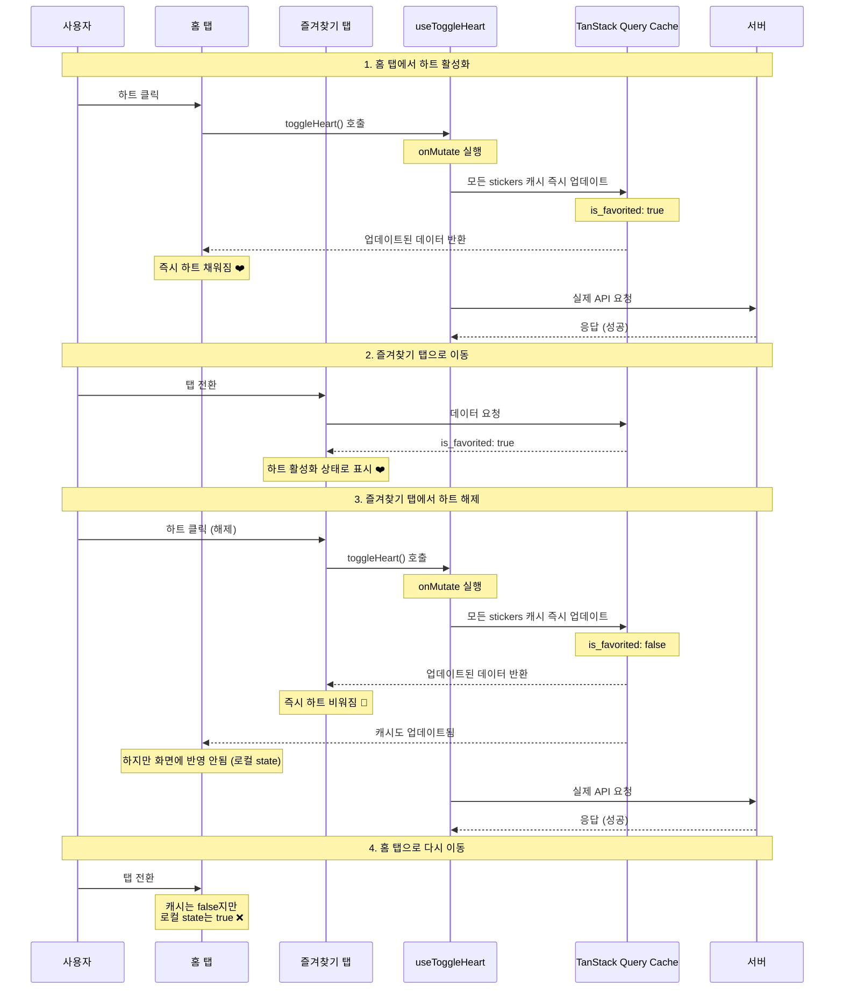

# 즐겨찾기 상태 불일치 문제: Single Source of Truth

> **트러블슈팅 문서**  
> 프로젝트: Stickr  
> 작성일: 2025-10-31

<br/>

## 📋 목차
- [문제의 시작](#-문제의-시작)
- [복합적인 원인들](#-복합적인-원인들)
- [시행착오: 동기화 로직으로 해결하려 했던 시도](#-시행착오-동기화-로직으로-해결하려-했던-시도)
- [Single Source of Truth: 근본적인 해결](#-single-source-of-truth-근본적인-해결)
- [최종 구현](#-최종-구현)
- [결과](#-결과)
- [배운 것들](#-배운-것들)

<br/>

## 🔴 문제의 시작

**즐겨찾기 탭에서 하트를 해제했는데, 홈 탭으로 돌아가면 여전히 하트가 활성화되어 있었습니다.**

### 문제 시나리오

```
1. 최초 앱 구동 후 홈 탭에서 즐겨찾기 활성화
   [홈 탭]
   ┌────────────┐
   │  🤍 스티커 1 │  클릭!
   │  🤍 스티커 2 │
   └────────────┘
           ↓
   ┌────────────┐
   │  ❤️ 스티커 1 │  ← 하트 활성화 ✅
   │  🤍 스티커 2 │
   └────────────┘

2. 즐겨찾기 탭으로 이동
   [즐겨찾기 탭]
   ┌────────────┐
   │  ❤️ 스티커 1 │  ← 정상 반영됨 ✅
   └────────────┘

3. 즐겨찾기 탭에서 하트 해제
   [즐겨찾기 탭]
   ┌────────────┐
   │  ❤️ 스티커 1 │  클릭!
   └────────────┘
           ↓
   ┌────────────┐
   │  🤍 스티커 1 │  ← 하트 해제됨 ✅
   └────────────┘

4. 홈 탭으로 다시 이동
   [홈 탭]
   ┌────────────┐
   │  ❤️ 스티커 1 │  ← 여전히 하트가 활성화? ❌
   │  🤍 스티커 2 │
   └────────────┘
```

**정리**:
- 홈 → 즐겨찾기: 정상 작동 ✅
- **즐겨찾기 → 홈: 반영 안됨** ❌
- 앱을 재시작하면 정상 작동 ✅

"뭔가 화면 간 데이터가 동기화되지 않는 것 같은데..." 하는 막연한 느낌만 있었습니다.

<br/>

## 🔍 복합적인 원인들

문제를 파고들수록, 단순한 버그가 아니라는 것을 깨달았습니다. **세 가지 요소가 복합적으로 얽혀** 발생한 문제였습니다.

### 1. React Navigation의 LazyLoading

```tsx
// src/navigations/BottomTabNavigation.tsx
<Tab.Navigator>
  <Tab.Screen name="MainScreen" component={MainScreen} />
  <Tab.Screen name="FavoritesScreen" component={FavoritesScreen} />
  <Tab.Screen name="MyPageScreen" component={MyPageNavigation} />
</Tab.Navigator>
```

React Navigation의 BottomTab은 성능 최적화를 위해 **LazyLoading 방식**을 사용합니다.

```
처음 앱 실행 (홈 탭):
- MainScreen: ✅ 마운트됨
- FavoritesScreen: ❌ 마운트 안됨
- MyPageScreen: ❌ 마운트 안됨

사용자가 즐겨찾기 탭으로 이동:
- MainScreen: ✅ 여전히 마운트된 채로 유지 (메모리에 남아있음!)
- FavoritesScreen: ✅ 새로 마운트됨
- MyPageScreen: ❌ 마운트 안됨

다시 홈 탭으로 돌아옴:
- MainScreen: ✅ 계속 마운트된 채로 (처음 마운트된 상태 그대로!)
- FavoritesScreen: ✅ 여전히 마운트된 채로 유지 (언마운트 안됨!)
- MyPageScreen: ❌ 마운트 안됨
```

**핵심**: 탭을 전환해도 이전 탭은 **언마운트되지 않고 메모리에 그대로 유지**됩니다!  
즉, 홈 탭은 **처음 마운트된 시점의 데이터**를 계속 가지고 있습니다!

### 2. TanStack Query의 invalidateQueries

즐겨찾기를 토글하면 `invalidateQueries`를 호출해 데이터를 새로고침합니다.

```typescript
// useToggleHeart.ts (초기 구현)
onSettled: () => {
  queryClient.invalidateQueries({ queryKey: ['stickers'] });
}
```

하지만 `invalidateQueries`의 동작 방식에는 중요한 특징이 있었습니다:

```
invalidateQueries 호출 시:

- 마운트된 컴포넌트: 즉시 재페칭 ✅
- 마운트 안된 컴포넌트: 다음 마운트 시점에 재페칭 ⏰
```

즉, **현재 보고 있지 않은 탭은 즉시 업데이트되지 않습니다!**

### 3. 각 컴포넌트의 독립적인 로컬 State

가장 큰 문제는 **각 `StickerCard` 컴포넌트가 자신만의 로컬 state를 가지고 있었다**는 것입니다.

```tsx
// ❌ 문제가 있던 초기 코드
const StickerCard = ({ sticker }: StickerCardProps) => {
  // 각 카드가 독립적인 로컬 state를 가짐!
  const [isFavorited, setIsFavorited] = useState(sticker.is_favorited);
  const [likeCount, setLikeCount] = useState(sticker.like_count);

  const handleHeartPress = async () => {
    // 로컬 state만 업데이트
    setIsFavorited(!isFavorited);
    setLikeCount(prev => isFavorited ? prev - 1 : prev + 1);
    
    // 서버에 요청
    await toggleFavorite(sticker.id);
  };

  return (
    <View>
      <HeartButton 
        isFavorited={isFavorited}  // ← 로컬 state 사용!
        onPress={handleHeartPress} 
      />
      <Text>{likeCount}</Text>
    </View>
  );
};
```

**문제점**:
- 홈 탭의 스티커 카드: 자신의 `isFavorited` state 가짐
- 즐겨찾기 탭의 동일한 스티커 카드: **완전히 다른** `isFavorited` state 가짐
- 각자가 독립적으로 동작 → **동기화 필요**

### 문제의 본질

이 세 가지가 복합적으로 얽히면서 다음과 같은 상황이 발생했습니다:

```
1. 홈 탭에서 하트 활성화 (최초)
   └─> 홈 탭 StickerCard의 로컬 state: isFavorited = true ✅
   └─> 서버 요청 전송 ✅
   └─> invalidateQueries 호출 ✅

2. 즐겨찾기 탭으로 이동
   └─> 즐겨찾기 탭 새로 마운트됨
   └─> TanStack Query 캐시에서 데이터 가져옴
   └─> 즐겨찾기 탭 StickerCard의 로컬 state: isFavorited = true ✅

3. 즐겨찾기 탭에서 하트 해제
   └─> 즐겨찾기 탭 StickerCard의 로컬 state: isFavorited = false ✅
   └─> 서버 요청 전송 ✅
   └─> invalidateQueries 호출 ✅

4. invalidateQueries 실행
   └─> 즐겨찾기 탭 (마운트됨): 즉시 재페칭 ✅
   └─> 홈 탭 (마운트됨, 메모리에 있음): 즉시 재페칭 ✅

5. 홈 탭으로 다시 이동
   └─> 홈 탭의 TanStack Query 캐시는 최신 상태 (is_favorited: false) ✅
   └─> BUT, 홈 탭 StickerCard의 로컬 state는 여전히 true! ❌
   └─> (이미 useState로 초기화된 state는 props가 변해도 자동으로 업데이트 안됨!)
```

**핵심 문제**: 
- TanStack Query 캐시는 최신 상태 (`is_favorited: false`)
- 하지만 홈 탭 컴포넌트의 로컬 state는 **처음 마운트 시점의 상태** (`isFavorited: true`)를 유지!

<br/>

## 🔨 시행착오: 동기화 로직으로 해결하려 했던 시도

처음에는 "동기화 로직"을 추가하면 되겠다고 생각했습니다.

### 시도 1: useEffect로 props 변경 감지

```tsx
// 시도했지만 복잡해진 코드
const StickerCard = ({ sticker }: StickerCardProps) => {
  const [isFavorited, setIsFavorited] = useState(sticker.is_favorited);
  
  // props가 변경되면 로컬 state도 업데이트
  useEffect(() => {
    setIsFavorited(sticker.is_favorited);
  }, [sticker.is_favorited]);
  
  // ...
};
```

**문제점**:
- 여전히 로컬 state를 유지하면서 동기화 로직 추가
- `useEffect`가 실행되는 타이밍 문제
- 불필요한 리렌더링 발생

### 시도 2: 커스텀 이벤트로 전파

```tsx
// 더 복잡해진 코드
const handleHeartPress = async () => {
  setIsFavorited(!isFavorited);
  await toggleFavorite(sticker.id);
  
  // 다른 컴포넌트들에게 알림
  EventEmitter.emit('favorite-changed', { 
    stickerId: sticker.id, 
    isFavorited: !isFavorited 
  });
};

// 다른 컴포넌트에서
useEffect(() => {
  const listener = EventEmitter.on('favorite-changed', ({ stickerId, isFavorited }) => {
    if (stickerId === sticker.id) {
      setIsFavorited(isFavorited);
    }
  });
  
  return () => listener.remove();
}, []);
```

**문제점**:
- 이벤트 리스너 관리의 복잡성
- 메모리 누수 위험
- 코드가 점점 복잡해짐

### 시도 3: Context API로 중앙 관리

```tsx
// 오버엔지니어링
const FavoriteContext = createContext();

const FavoriteProvider = ({ children }) => {
  const [favorites, setFavorites] = useState(new Map());
  
  const toggleFavorite = (stickerId, isFavorited) => {
    setFavorites(prev => new Map(prev).set(stickerId, isFavorited));
  };
  
  return (
    <FavoriteContext.Provider value={{ favorites, toggleFavorite }}>
      {children}
    </FavoriteContext.Provider>
  );
};
```

**문제점**:
- 이미 TanStack Query가 서버 state를 관리하고 있는데, 또 다른 state 관리 추가
- 두 가지 출처 간의 동기화 문제는 여전히 존재
- 복잡도만 증가

### 깨달음

점점 더 복잡한 동기화 로직을 작성하면서 깨달았습니다:

**"이건 잘못된 방향이다. 문제를 '해결'하려고 하지 말고, 문제가 '발생하지 않도록' 만들어야 한다."**

<br/>

## ✅ Single Source of Truth: 근본적인 해결

### 핵심 아이디어

**"데이터는 한 곳에서만 관리하라"**는 원칙은 여러 번 들어본 이야기였습니다. 하지만 실제로 분산된 state로 인한 문제를 겪고 나서야, 이 원칙이 왜 중요한지 체감할 수 있었습니다.

### 해결 방향

```
Before (문제):
┌────────────────────────────────────────────────┐
│ 홈 탭                                          │
│  └─ StickerCard (로컬 state: isFavorited)     │
│  └─ StickerCard (로컬 state: isFavorited)     │
├────────────────────────────────────────────────┤
│ 즐겨찾기 탭                                    │
│  └─ StickerCard (로컬 state: isFavorited)     │  ← 동기화 필요!
│  └─ StickerCard (로컬 state: isFavorited)     │
└────────────────────────────────────────────────┘
       ↕ 복잡한 동기화 로직 필요

After (해결):
┌────────────────────────────────────────────────┐
│          TanStack Query Cache                  │
│      (Single Source of Truth)                  │
│  { id: '1', is_favorited: true, ... }         │
│  { id: '2', is_favorited: false, ... }        │
└────────────────────────────────────────────────┘
              ↓ 모두 이곳에서 읽음
┌────────────────────────────────────────────────┐
│ 홈 탭: StickerCard (캐시에서 읽음)            │
│ 즐겨찾기 탭: StickerCard (캐시에서 읽음)      │
└────────────────────────────────────────────────┘
       ✅ 동기화 로직 불필요!
```

### 구체적인 변경사항

**1. 로컬 state 완전 제거**

```tsx
// 개선된 코드
const StickerCard = ({ sticker }: StickerCardProps) => {
  // 제거: const [isFavorited, setIsFavorited] = useState(sticker.is_favorited);
  // 제거: const [likeCount, setLikeCount] = useState(sticker.like_count);
  
  // props에서 직접 사용 (TanStack Query 캐시에서 온 값)
  const { mutate: toggleHeart } = useToggleHeart();
  
  const handleHeartPress = () => {
    toggleHeart({
      stickerId: sticker.id,
      currentIsFavorited: sticker.is_favorited ?? false,  // props에서 직접 읽음
      currentLikeCount: sticker.like_count ?? 0,
    });
  };

  return (
    <View>
      <HeartButton 
        isFavorited={sticker.is_favorited}  // props에서 직접 사용
        onPress={handleHeartPress} 
      />
      <Text>{sticker.like_count}</Text>
    </View>
  );
};
```

**2. 낙관적 업데이트로 즉시 모든 캐시 갱신**

```typescript
// src/hooks/query/useToggleHeart.ts
export function useToggleHeart() {
  return useMutation({
    mutationFn: ({ stickerId }: Variables) => toggleFavorite(stickerId),

    // 서버 요청 전에 모든 캐시를 즉시 업데이트
    onMutate: async ({ stickerId, currentIsFavorited, currentLikeCount = 0 }) => {
      // 1. 진행 중인 쿼리 취소 (경쟁 상태 방지)
      await queryClient.cancelQueries({ queryKey: ['stickers'], exact: false });

      // 2. 현재 캐시 백업 (실패 시 롤백용)
      const prevStickers = queryClient.getQueriesData({ queryKey: ['stickers'] });

      // 3. 새로운 상태 계산
      const nextIsFavorited = !currentIsFavorited;
      const likeDelta = nextIsFavorited ? 1 : -1;

      // 4. 캐시 업데이트 함수
      const updateStickerInPages = (old: any) => {
        if (!old || !Array.isArray(old.pages)) return old;

        return {
          ...old,
          pages: old.pages.map((page: any) => ({
            ...page,
            data: page.data.map((s: Sticker) =>
              s.id === stickerId
                ? {
                    ...s,
                    is_favorited: nextIsFavorited,  // ← 여기가 핵심!
                    like_count: Math.max(0, (s.like_count ?? currentLikeCount) + likeDelta),
                  }
                : s
            ),
          })),
        };
      };

      // 5. 모든 stickers 쿼리 캐시 즉시 업데이트
      queryClient.setQueriesData(
        { queryKey: ['stickers'], exact: false },
        updateStickerInPages
      );

      return { prevStickers };
    },

    // 실패 시 롤백
    onError: (_err, _vars, ctx) => {
      ctx?.prevStickers?.forEach(([key, data]: any) =>
        queryClient.setQueryData(key, data)
      );
    },

    // 최종 정합성 보장
    onSettled: () => {
      queryClient.invalidateQueries({ queryKey: ['stickers'] });
    },
  });
}
```

<br/>

## 💻 최종 구현

### 전체 흐름



### 핵심 코드

**1. StickerCard 컴포넌트 (로컬 state 제거)**

```tsx
// src/components/StickerCard.tsx
export const StickerCard = ({ sticker, size, borderRadius, onPress }: StickerCardProps) => {
  const { mutate: toggleHeart } = useToggleHeart();
  
  // 로컬 state 없음, props에서 직접 사용
  const handleHeartPress = () => {
    toggleHeart({
      stickerId: sticker.id,
      currentIsFavorited: sticker.is_favorited ?? false,
      currentLikeCount: sticker.like_count ?? 0,
    });
  };

  return (
    <View>
      <Image source={{ uri: sticker.image_url }} />
      <HeartButton 
        isFavorited={sticker.is_favorited}  // TanStack Query 캐시에서 온 값
        handleHeartPress={handleHeartPress}
      />
      <Text>{sticker.like_count}</Text>
    </View>
  );
};
```

**2. useToggleHeart 훅 (낙관적 업데이트)**

```typescript
// src/hooks/query/useToggleHeart.ts
export function useToggleHeart() {
  return useMutation({
    mutationFn: ({ stickerId }: Variables) => toggleFavorite(stickerId),

    onMutate: async ({ stickerId, currentIsFavorited, currentLikeCount = 0 }) => {
      // 모든 캐시를 즉시 업데이트
      await queryClient.cancelQueries({ queryKey: ['stickers'], exact: false });
      const prevStickers = queryClient.getQueriesData({ queryKey: ['stickers'] });

      const nextIsFavorited = !currentIsFavorited;
      const likeDelta = nextIsFavorited ? 1 : -1;

      queryClient.setQueriesData(
        { queryKey: ['stickers'], exact: false },
        (old: any) => {
          if (!old || !Array.isArray(old.pages)) return old;
          return {
            ...old,
            pages: old.pages.map((page: any) => ({
              ...page,
              data: page.data.map((s: Sticker) =>
                s.id === stickerId
                  ? { ...s, is_favorited: nextIsFavorited, like_count: Math.max(0, (s.like_count ?? currentLikeCount) + likeDelta) }
                  : s
              ),
            })),
          };
        }
      );

      return { prevStickers };
    },

    onError: (_err, _vars, ctx) => {
      // 실패 시 롤백
      ctx?.prevStickers?.forEach(([key, data]: any) =>
        queryClient.setQueryData(key, data)
      );
    },

    onSettled: () => {
      // 최종 정합성 보장
      queryClient.invalidateQueries({ queryKey: ['stickers'] });
    },
  });
}
```

**3. 서버 API**

```typescript
// src/api/sticker.ts
export async function toggleFavorite(
  stickerId: string
): Promise<{ is_favorited: boolean }> {
  const { data, error } = await supabase.rpc('toggle_favorite', {
    p_sticker_id: stickerId,
  });
  if (error) throw new Error(error.message);
  const row = Array.isArray(data) ? data[0] : data;
  return { is_favorited: (row as any)?.is_favorited };
}
```

<br/>

## 📊 결과

### 동기화 로직 제거

홈 탭과 즐겨찾기 탭의 동기화를 위해 작성했던 **복잡한 로직들이 모두 사라졌습니다**.

```diff
- useState로 로컬 state 관리
- useEffect로 props 변경 감지
- EventEmitter로 이벤트 전파
- Context API로 중앙 관리
- 동기화 타이밍 제어

+ TanStack Query 캐시만 사용
+ mutation 하나로 모든 컴포넌트 업데이트
```

**코드 변경량**:
- 삭제된 코드: ~150줄
- 추가된 코드: ~50줄
- 순 감소: ~100줄

### 동작 검증

| 시나리오 | Before | After |
|---------|--------|-------|
| 홈 탭에서 하트 활성화 → 즐겨찾기 탭 이동 | ✅ 정상 작동 | ✅ 정상 작동 |
| **즐겨찾기 탭에서 하트 해제 → 홈 탭 이동** | **❌ 반영 안됨** | **✅ 즉시 반영** |
| 홈 탭에서 하트 해제 → 즐겨찾기 탭 이동 | ❌ 반영 안됨 | ✅ 즉시 반영 |
| 검색 결과에서 하트 클릭 → 다른 탭 이동 | ❌ 반영 안됨 | ✅ 즉시 반영 |
| 네트워크 오류 발생 시 | ❌ 상태 꼬임 | ✅ 자동 롤백 |

### 사용자 경험

**Before**:
- 즐겨찾기 탭에서 하트 해제 → 홈 탭에서는 여전히 활성화 ❌
- "분명히 즐겨찾기 해제했는데 홈에선 왜 그대로지?" 😕
- 앱을 재시작해야 정상 작동 ❌
- 사용자가 혼란스러워함 ❌

**After**:
- 어느 탭에서 하트를 누르든 모든 탭에서 즉시 반영 ✅
- 일관되고 예측 가능한 동작 ✅
- 자연스러운 사용자 경험 ✅
- 네트워크 오류 시에도 안정적 ✅

<br/>

## 🎓 배운 것들

### 1. 복합 원인을 레이어별로 분리하여 근본 원인 찾기

처음에는 "왜 안 되지?"라는 막연한 질문만 있었습니다. 하지만 문제를 레이어별로 분리하면서 명확해졌습니다.

**분석 과정**:
1. **Navigation 레이어**: React Navigation의 LazyLoading 동작 확인
2. **State Management 레이어**: TanStack Query의 invalidateQueries 동작 확인
3. **Component 레이어**: 각 컴포넌트의 로컬 state 확인

각 레이어를 하나씩 확인하며 가설을 세우고 검증하는 과정을 반복했습니다.

```typescript
// 가설 검증을 위한 로그
useEffect(() => {
  console.log('FavoritesScreen mount');
  return () => console.log('FavoritesScreen unmount');
}, []);

// → 탭 전환 시 unmount 안됨을 확인!
```

### 2. Single Source of Truth의 진정한 의미

"데이터는 한 곳에서만 관리하라"는 원칙은 여러 번 들어본 이야기였습니다. 하지만 실제로 분산된 state로 인한 문제를 겪고 나서야, 이 원칙이 왜 중요한지 체감할 수 있었습니다.

**Before**: 여러 출처
```
- StickerCard A의 로컬 state: true
- StickerCard B의 로컬 state: false  ← 같은 스티커인데 다른 값!
- TanStack Query 캐시: true
- 서버 데이터: true

→ 어느 것이 진실인가? 🤔
```

**After**: 단일 출처
```
- TanStack Query 캐시: true
- 서버 데이터: true

→ 명확! ✅
```

### 3. 문제를 '해결'하지 말고 '발생하지 않도록' 만들기

동기화 문제를 해결하는 복잡한 로직을 작성하는 대신, **동기화가 필요 없는 구조를 만드는 것이 훨씬 근본적인 해결책**이었습니다.

```
잘못된 접근: "어떻게 동기화할까?"
  → useEffect, EventEmitter, Context API...
  → 복잡도 증가, 버그 증가

올바른 접근: "동기화가 필요 없는 구조는?"
  → Single Source of Truth
  → 복잡도 감소, 버그 감소
```

### 4. 좋은 아키텍처는 문제가 발생하지 않도록 만든다

이 과정에서 깨달은 것은, **좋은 아키텍처는 문제를 '해결'하는 것이 아니라 문제가 '발생하지 않도록' 만드는 것**이라는 점입니다.

```
나쁜 아키텍처:
  문제 발생 → 복잡한 해결책 추가 → 새로운 문제 발생 → 더 복잡한 해결책...

좋은 아키텍처:
  근본 원인 제거 → 문제 발생하지 않음 → 단순하고 명확한 코드
```

### 5. TanStack Query의 강력함

TanStack Query는 단순한 데이터 페칭 라이브러리가 아니었습니다:

- **캐시 관리**: 모든 쿼리의 단일 출처
- **낙관적 업데이트**: 즉각적인 UI 피드백
- **자동 롤백**: 에러 발생 시 안전성
- **정합성 보장**: invalidateQueries로 최종 동기화

이러한 기능들을 제대로 활용하면 복잡한 상태 관리 로직을 대부분 제거할 수 있습니다.

<br/>

## 📚 적용 가이드

다른 화면에서 비슷한 문제가 있다면:

### 체크리스트

**1. 로컬 state 확인**
```tsx
// 피해야 할 패턴
const [data, setData] = useState(props.data);

// 권장 패턴
const data = props.data;  // 서버 state 직접 사용
```

**2. 단일 출처 확인**
```typescript
// 데이터를 여러 곳에서 관리하고 있나요?
- 로컬 state: 피해야 함
- Context API: 피해야 함 (서버 데이터의 경우)
- TanStack Query 캐시: 권장
```

**3. 낙관적 업데이트 활용**
```typescript
useMutation({
  onMutate: async (variables) => {
    // 즉시 캐시 업데이트
    queryClient.setQueriesData(queryKey, updateFn);
  },
  onError: (err, vars, context) => {
    // 실패 시 롤백
    queryClient.setQueryData(queryKey, context.previous);
  },
  onSettled: () => {
    // 최종 정합성
    queryClient.invalidateQueries(queryKey);
  },
});
```

<br/>

---

<div align="center">

**✅ 해결 완료**  

복잡한 동기화 로직을 작성하는 대신,  
Single Source of Truth로 근본 원인을 제거했습니다.

여러 컴포넌트에 흩어진 로컬 state를 모두 제거하고,  
TanStack Query의 서버 state를 단일 출처로 사용함으로써  
동기화 문제가 **발생하지 않는** 구조를 만들었습니다. 🎉

**"좋은 아키텍처는 문제를 해결하는 것이 아니라  
문제가 발생하지 않도록 만드는 것이다."**

</div>

