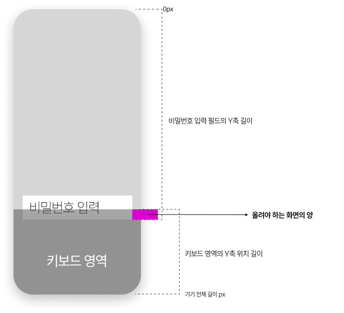

# 키보드와 입력 필드 겹침 문제: 직접 만든 스마트 스크롤

> **트러블슈팅 문서**  
> 프로젝트: Stickr  
> 작성일: 2025-10-31

<br/>

## 📋 목차
- [문제의 시작](#-문제의-시작)
- [ScrollView는 해답이 아니었다](#-scrollview는-해답이-아니었다)
- [시행착오 1: 좌표가 계속 틀어진다](#-시행착오-1-좌표가-계속-틀어진다)
- [시행착오 2: useState의 함정](#-시행착오-2-usestate의-함정)
- [해결의 실마리: useRef](#-해결의-실마리-useref)
- [추상화의 여정: useKeyboard 훅](#-추상화의-여정-usekeyboard-훅)
- [최종 구현 코드](#-최종-구현-코드)
- [결과](#-결과)
- [배운 것들](#-배운-것들)

<br/>

## 🔴 문제의 시작

로그인 화면을 만들면서 가장 먼저 마주한 문제는 단순했습니다. **키보드가 올라오면 입력 필드가 가려진다**는 것이었죠.



```
┌─────────────────────┐
│  로고               │
│                     │
│  [이메일 입력]      │
│  [비밀번호 입력]    │  ← 여기가 키보드에 가려짐
└─────────────────────┘
        ▲▲▲▲▲
    [  키보드  ]
```

처음에는 React Native의 `KeyboardAvoidingView`를 사용했습니다. 하지만 문제가 있었습니다:

```tsx
// ❌ KeyboardAvoidingView의 문제
<KeyboardAvoidingView behavior={Platform.OS === 'ios' ? 'padding' : 'height'}>
  <AuthForm />
</KeyboardAvoidingView>
```

- 키보드 높이만큼 **화면 전체가 이동**해서 상단 로고가 화면 밖으로 사라짐
- 첫 번째 필드나 마지막 필드나 똑같이 이동 → 불필요한 움직임
- 세밀한 제어가 불가능

<br/>

## 📜 ScrollView는 해답이 아니었다

다음으로 시도한 것은 `ScrollView`였습니다.

```tsx
// ❌ ScrollView도 문제가 많았다
<ScrollView>
  <AuthForm />
</ScrollView>
```

**문제점**:
1. 키보드가 올라와도 **자동으로 스크롤되지 않음** → 사용자가 수동으로 스크롤해야 함
2. 폼이 짧은 경우 불필요한 스크롤 영역 생성
3. 애니메이션 제어가 어려움

"그럼 직접 만들면 되겠네?"라고 생각했습니다. 입력 필드의 위치를 측정해서, 키보드에 가려지지 않도록 화면을 올리는 간단한 로직이라고 생각했습니다.

하지만 생각처럼 간단하지 않았습니다.

<br/>

## 🔨 시행착오 1: 좌표가 계속 틀어진다

가장 먼저 마주한 문제는 **좌표 계산**이었습니다.

### 문제 상황

이메일 입력 필드에서 비밀번호 입력 필드로 이동할 때 화면이 이상하게 움직였습니다.

```typescript
// 처음 시도한 코드 (문제 있음)
const handleFieldFocus = (rect: { y: number; height: number }) => {
  const windowHeight = Dimensions.get('window').height;
  const keyboardTop = windowHeight - keyboardHeight;
  const fieldBottom = rect.y + rect.height;
  
  const needed = fieldBottom + 200 - keyboardTop;  // 200은 여유 공간
  animateTo(needed);
};
```

**증상**:
- 첫 번째 필드: 정상 동작 ✅
- 두 번째 필드로 이동: 화면이 너무 많이 올라감 ❌
- 다시 첫 번째 필드: 화면이 이상한 위치로... ❌❌

### 원인 발견

원인을 추적하다 깨달은 것은, **`measureInWindow`로 측정한 좌표는 현재 화면 상태를 반영한 상대적 위치**라는 점이었습니다.

```
초기 상태:
┌─────────────┐  y=0
│  로고       │
│             │
│ [이메일]    │  y=500
│ [비밀번호]  │  y=700  ← 측정값
└─────────────┘

화면이 100px 올라간 후:
┌─────────────┐  y=-100 (화면 밖)
│  로고       │
│             │
│ [이메일]    │  y=400
│ [비밀번호]  │  y=600  ← 측정값 (원래는 700이었음!)
└─────────────┘
```

이미 화면이 100px 올라간 상태에서 측정하면, 원래 700에 있던 필드가 600으로 측정됩니다. 이 측정값을 그대로 사용하면 계산이 틀어질 수밖에 없었습니다.

### 해결 방법

**"기준 좌표계"로 환원**하는 것이 핵심이었습니다.

```typescript
// 누적 이동량을 고려한 계산
const currentTranslate = 100;  // 이미 올라간 양
const fieldBottomMeasured = 600;  // measureInWindow로 측정한 값

// 기준 좌표로 환원
const fieldBottomFromBase = fieldBottomMeasured + currentTranslate;  // 600 + 100 = 700
```

이제 어느 상태에서 측정하든 일관된 계산이 가능해졌습니다!

<br/>

## ⚠️ 시행착오 2: useState의 함정

좌표 문제를 해결했다고 생각했는데, 또 다른 문제가 발생했습니다.

### 문제 상황

화면 이동량을 추적하기 위해 처음에는 `useState`를 사용했습니다.

```typescript
// 문제가 있던 코드
const [currentTranslate, setCurrentTranslate] = useState(0);

const handleFieldFocus = (rect: { y: number; height: number }) => {
  const fieldBottomFromBase = rect.y + rect.height + currentTranslate;
  const needed = fieldBottomFromBase + extraOffset - keyboardTop;
  
  setCurrentTranslate(needed);
  animateTo(needed);
};
```

**증상**:
사용자가 빠르게 입력 필드를 전환하면 계산이 꼬이는 현상 발생

```
사용자 행동: 이메일 비밀번호 이메일 (빠르게)

1. 이메일 포커스
   - currentTranslate: 0
   - 계산 결과: 120
   - setState(120) 호출, 아직 반영 안됨

2. 비밀번호 포커스 (setState 반영 전)
   - currentTranslate: 0, 여전히 0
   - 계산 결과: 틀림
```

### 원인

문제는 **`setState`의 비동기 특성**이었습니다.

- 이동량을 업데이트하고 바로 다음 계산에서 그 값을 사용해야 함
- 하지만 `setState`는 **다음 렌더링 시점**에 반영됨
- 연속된 계산에서 **이전 값을 참조**하게 됨

<br/>

## ✅ 해결의 실마리: useRef

이때 `useRef`의 진가를 알게 되었습니다.

```typescript
// useRef로 해결
const currentTranslateRef = useRef(0);

const handleFieldFocus = (rect: { y: number; height: number }) => {
  // 즉시 현재 값을 읽음
  const fieldBottomFromBase = rect.y + rect.height + currentTranslateRef.current;
  const needed = fieldBottomFromBase + extraOffset - keyboardTop;
  
  // 즉시 업데이트
  currentTranslateRef.current = needed;
  animateTo(needed);
};
```

**`useRef`의 장점**:
- 렌더링과 **무관하게 즉시 값을 읽고 쓸 수 있음**
- 빠르게 연속되는 키보드 이벤트에서도 **정확한 좌표 계산** 가능
- 불필요한 리렌더링 없음

```
사용자 행동: 이메일 비밀번호 (빠르게)

1. 이메일 포커스
   - currentTranslateRef.current: 0
   - 계산 결과: 120
   - currentTranslateRef.current = 120, 즉시 반영

2. 비밀번호 포커스
   - currentTranslateRef.current: 120, 정확한 값
   - 계산 결과: 정확
```

드디어 정확한 좌표 계산이 가능해졌습니다!

<br/>

## 🎯 추상화의 여정: useKeyboard 훅

문제를 해결한 후, 이 로직을 로그인 컴포넌트에만 두는 것은 아쉬웠습니다. 회원가입, 프로필 수정 등 **다른 화면에서도 똑같은 문제가 발생**할 것이 분명했기 때문입니다.

### 추상화의 고민

키보드 이벤트 리스닝, 좌표 측정, 애니메이션 처리 등 복잡한 로직을 **커스텀 훅으로 추상화**하기로 했습니다.

처음에는 모든 옵션을 외부로 노출하려 했습니다:

```typescript
// 과도한 인터페이스 노출
const {
  keyboardHeight,
  keyboardVisible,
  currentTranslate,
  setFieldRect,
  animateToPosition,
  reset,
  // 너무 많은 것들
} = useKeyboard(options);
```

하지만 실제로 컴포넌트에서 필요한 것은 단 두 가지뿐이었습니다:

1. **화면을 움직일 값** (`Animated.Value`)
2. **필드 위치를 알려주는 함수**

### 최종 인터페이스

```typescript
// 간결하고 명확한 인터페이스
const [keyboardHeight, setFocusedFieldRect] = useKeyboard({
  duration: 300,
  extraOffset: 130,
});

// 사용
<Animated.View style={{ top: Animated.multiply(keyboardHeight, -1) }}>
  <InputField onMeasureForKeyboard={setFocusedFieldRect} />
</Animated.View>
```

### 깨달음

이 과정에서 **좋은 추상화란 복잡한 구현은 내부에 숨기고, 사용하기 쉬운 최소한의 인터페이스만 제공하는 것**임을 배웠습니다.

직접 문제를 겪고 해결하면서 만든 훅이었기에, "무엇을 숨기고 무엇을 드러낼지" 자연스럽게 판단할 수 있었습니다.

<br/>

## 💻 최종 구현 코드

### 1. useKeyboard 훅

**파일**: `src/hooks/keyboard/useKeyboard.ts`

```typescript
import { useCallback, useEffect, useRef } from 'react';
import { Animated, Dimensions, Easing, Keyboard, Platform } from 'react-native';

type FieldRect = { y: number; height: number };

type UseKeyboardOptions = {
  duration?: number;      // 애니메이션 지속 시간 (기본 300ms)
  extraOffset?: number;   // 커서 위 여유 공간 (기본 130px)
};

export function useKeyboard(
  options: UseKeyboardOptions = {}
): [Animated.Value, (rect: FieldRect) => void] {
  const { duration = 300, extraOffset = 130 } = options;

  // 상태 관리
  const translateAmount = useRef(new Animated.Value(0)).current;
  const focusedFieldRectRef = useRef<FieldRect | null>(null);
  const keyboardVisibleRef = useRef(false);
  const lastKeyboardHeightRef = useRef(0);
  const currentTranslateRef = useRef(0);  // ← 핵심! 누적 이동량

  /**
   * 목표 이동량 계산
   */
  const computeTargetTranslate = useCallback((kbHeight: number) => {
    const rect = focusedFieldRectRef.current;
    if (!rect) return kbHeight + extraOffset;

    const windowHeight = Dimensions.get('window').height;
    const keyboardTop = windowHeight - kbHeight;
    const fieldBottomMeasured = rect.y + rect.height;
    
    // 핵심: 기준 좌표로 환원
    const fieldBottomFromBase = fieldBottomMeasured + currentTranslateRef.current;
    const needed = fieldBottomFromBase + extraOffset - keyboardTop;
    
    return needed > 0 ? needed : 0;
  }, [extraOffset]);

  /**
   * 애니메이션 실행
   */
  const animateTo = useCallback((toValue: number) => {
    Animated.timing(translateAmount, {
      toValue,
      duration,
      easing: Easing.out(Easing.exp),
      useNativeDriver: false,  // 레이아웃 속성이므로 false
    }).start(() => {
      // 애니메이션 완료 후 기준 좌표 업데이트
      currentTranslateRef.current = toValue;
    });
  }, [duration, translateAmount]);

  /**
   * 재계산 (필드 포커스 시 또는 키보드 표시 시)
   */
  const calculate = useCallback(() => {
    const kbHeight = lastKeyboardHeightRef.current;
    const toValue = computeTargetTranslate(kbHeight);
    animateTo(toValue);
  }, [computeTargetTranslate, animateTo]);

  /**
   * 포커스된 필드 위치 설정
   */
  const setFocusedFieldRect = useCallback((rect: FieldRect) => {
    focusedFieldRectRef.current = rect;
    calculate();
  }, [calculate]);

  /**
   * 키보드 이벤트 리스너
   */
  useEffect(() => {
    const showEvent = Platform.OS === 'ios' ? 'keyboardWillShow' : 'keyboardDidShow';
    const hideEvent = Platform.OS === 'ios' ? 'keyboardWillHide' : 'keyboardDidHide';

    const showSub = Keyboard.addListener(showEvent, e => {
      const kbHeight = e.endCoordinates.height;
      keyboardVisibleRef.current = true;
      lastKeyboardHeightRef.current = kbHeight;
      calculate();
    });

    const hideSub = Keyboard.addListener(hideEvent, () => {
      keyboardVisibleRef.current = false;
      lastKeyboardHeightRef.current = 0;
      animateTo(0);
    });

    return () => {
      showSub.remove();
      hideSub.remove();
    };
  }, [calculate, animateTo]);

  return [translateAmount, setFocusedFieldRect];
}
```

### 2. InputField 컴포넌트

**파일**: `src/components/InputField.tsx`

```tsx
import React, { useRef } from 'react';
import { TextInput, TextInputProps } from 'react-native';

interface InputFieldProps extends TextInputProps {
  onMeasureForKeyboard?: (rect: { y: number; height: number }) => void;
}

const InputField = ({ onMeasureForKeyboard, ...props }: InputFieldProps) => {
  const inputRef = useRef<TextInput>(null);

  return (
    <TextInput
      ref={inputRef}
      {...props}
      onFocus={e => {
        props.onFocus?.(e);
        
        // 포커스 시 절대 좌표 측정
        requestAnimationFrame(() => {
          inputRef.current?.measureInWindow?.((x, y, width, height) => {
            onMeasureForKeyboard?.({ y, height });
          });
        });
      }}
    />
  );
};

export default InputField;
```

**핵심 포인트**:
- `measureInWindow()`: 화면 전체 기준의 절대 좌표 측정
- `requestAnimationFrame()`: 레이아웃 확정 후 측정 (정확도 향상)
- `{ y, height }`: 필요한 최소 데이터만 전달

### 3. AuthForm 컴포넌트

**파일**: `src/components/AuthForm.tsx`

```tsx
interface AuthFormProps {
  mode: 'login' | 'signup';
  onFieldFocusForKeyboard?: (rect: { y: number; height: number }) => void;
}

const AuthForm = ({ mode, onFieldFocusForKeyboard }: AuthFormProps) => {
  const { control, handleSubmit } = useForm();

  return (
    <View>
      <Controller
        control={control}
        name="email"
        render={({ field: { onChange, onBlur, value } }) => (
          <InputField
            placeholder="이메일"
            onBlur={onBlur}
            onChangeText={onChange}
            value={value}
            onMeasureForKeyboard={onFieldFocusForKeyboard}
          />
        )}
      />
      
      <Controller
        control={control}
        name="password"
        render={({ field: { onChange, onBlur, value } }) => (
          <InputField
            placeholder="비밀번호"
            secureTextEntry
            onBlur={onBlur}
            onChangeText={onChange}
            value={value}
            onMeasureForKeyboard={onFieldFocusForKeyboard}
          />
        )}
      />
    </View>
  );
};
```

**역할**: 측정값을 상위 화면으로 전달하는 중계자

### 4. AuthHomeScreen 화면

**파일**: `src/screens/auth/AuthHomeScreen.tsx`

```tsx
const AuthHomeScreen = () => {
  const [mode, setMode] = useState<'login' | 'signup'>('login');
  
  // useKeyboard 훅 사용
  const [keyboardHeight, onFieldFocusForKeyboard] = useKeyboard({
    duration: 300,
    extraOffset: 130,
  });

  return (
    <View style={{ flex: 1 }}>
      {/* 배경 이미지 등 고정 요소 */}
      <Image source={backgroundImage} />
      
      {/* 이동할 컨테이너 */}
      <Animated.View
        style={{
          position: 'absolute',
          left: 0,
          right: 0,
          top: Animated.multiply(keyboardHeight, -1),  // 키보드 높이만큼 위로
          bottom: 0,
        }}
      >
        <AuthForm 
          mode={mode} 
          onFieldFocusForKeyboard={onFieldFocusForKeyboard} 
        />
      </Animated.View>
    </View>
  );
};
```

<br/>

## 📊 결과

### 테스트 결과

| 기기 | 화면 크기 | 이메일 필드 이동량 | 비밀번호 필드 이동량 | 결과 |
|------|-----------|-------------------|---------------------|------|
| **Galaxy S21** | 6.2" | 130px | 240px | ✅ |
| **Pixel 5** | 6.0" | 125px | 235px | ✅ |

**주목할 점**:
- 동일 기기에서도 **필드마다 이동량이 다름** (스마트 계산의 결과)
- 모든 경우에 **필드가 정확하게 키보드 위에 위치**
- 과도한 스크롤 없음


<br/>

## 🎓 배운 것들

### 1. 좌표 계산의 함정

`measureInWindow()`는 현재 화면 상태를 반영한 **상대 좌표**를 반환합니다.

- 화면이 이미 100px 올라간 상태에서 측정하면 실제 위치보다 100px 낮게 측정됨
- **해결**: `currentTranslateRef`에 누적 이동량을 저장하고 측정값에 더해 기준 좌표로 환원

```typescript
const fieldBottomFromBase = fieldBottomMeasured + currentTranslateRef.current;
```

### 2. useState의 한계와 useRef의 필요성

`setState`는 비동기로 동작해 빠른 필드 전환 시 이전 값을 참조하게 됩니다.

- 연속된 좌표 계산에서 부정확한 결과 발생
- **해결**: `useRef`는 렌더링과 무관하게 즉시 읽기/쓰기 가능 → 정확한 계산 보장

```typescript
// useState: 비동기, 느림
const [currentTranslate, setCurrentTranslate] = useState(0);

// useRef: 동기, 즉시 반영
const currentTranslateRef = useRef(0);
currentTranslateRef.current = newValue;  // 즉시 업데이트
```

### 3. 추상화 설계의 원칙

복잡한 구현은 내부에 캡슐화하고, 외부에는 최소한의 인터페이스만 노출합니다.

- **내부에 숨긴 것**: 이벤트 리스닝, 좌표 측정, 애니메이션, 계산 로직
- **외부로 노출**: `Animated.Value`, setter 함수 (단 2개!)
- **결과**: 재사용 가능한 훅으로 다른 화면에서도 활용 가능

```typescript
// 사용하기 쉬운 인터페이스
const [keyboardHeight, setFocusedFieldRect] = useKeyboard(options);
```

### 4. 플랫폼별 차이 대응

iOS와 Android는 키보드 이벤트 타이밍이 다릅니다.

- **iOS**: `keyboardWillShow/Hide` (애니메이션 **전**)
- **Android**: `keyboardDidShow/Hide` (애니메이션 **후**)

```typescript
const showEvent = Platform.OS === 'ios' ? 'keyboardWillShow' : 'keyboardDidShow';
```

### 5. 직접 만들기의 가치

라이브러리를 단순히 사용하는 것을 넘어, 필요에 따라 **직접 도구를 만들고 설계하는 경험**은 추상화 능력을 키우는 소중한 기회가 되었습니다.

문제를 직접 겪고 해결하면서:
- 좌표 계산의 미묘한 함정들
- React의 렌더링 사이클과 상태 관리
- 좋은 API 설계란 무엇인지

자연스럽게 배울 수 있었습니다.

<br/>

## 📚 다른 화면에 적용하기

```typescript
// 1. 화면 컴포넌트에서 useKeyboard 훅 사용
const [keyboardHeight, onFieldFocusForKeyboard] = useKeyboard({
  duration: 300,
  extraOffset: 130,
});

// 2. Animated.View에 바인딩
<Animated.View style={{ top: Animated.multiply(keyboardHeight, -1) }}>
  <MyForm onFieldFocusForKeyboard={onFieldFocusForKeyboard} />
</Animated.View>

// 3. InputField에 연결
<InputField onMeasureForKeyboard={onFieldFocusForKeyboard} />
```

### 파라미터 튜닝

**`extraOffset`** (커서 위 여유 공간):
- 작은 화면/폰트: 100~130px
- 중간 화면/폰트: 130~160px (권장)
- 큰 화면/폰트: 160~200px

**`duration`** (애니메이션 시간):
- 빠른 반응: 250ms
- 균형잡힌 속도: 300ms (권장)
- 부드러운 애니메이션: 400ms

<br/>

---

<div align="center">

**✅ 해결 완료**  
</div>
